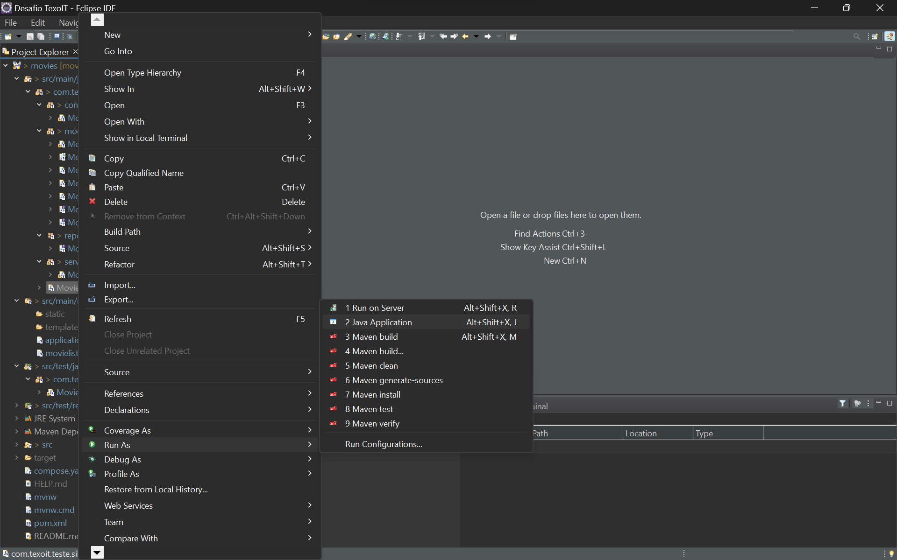

# Teste API - Golden Raspberry Awards (Silvio Pereira Guedes)

## Requirements

Para construir e executar a aplicação você precisa:

- [JDK 17](https://www.oracle.com/java/technologies/downloads/#java17)
- [Maven 3.8](https://maven.apache.org)

## Executando localmente com IDE Eclipse

   
### Importando o Projeto Maven
  
Acione o menu `File -> Import...`

    
    
    
Será aberto o diálogo `Import`. Então selecione a opção `Maven -> Existing Maven Projects` e acione o comando ` Next > `

    
    
    
O próximo diálogo será `Maven Projects`. Acione o comando `Browse...` e navegue até o diretório contendo o projeto e o arquivo `pom.xml`. Pode acionar o comando ` Finish ` e aguardar o Maven configurar/atualizar as dependências do projeto.

    
    
    
Ao final do import é esperado que o projeto esteja pronto para ser executado.

    
    
   
### Executando a API

Acione o menu de contexto (right click) sobre o arquivo `src/main/java/com/texoit/teste/silvio/MovieApplication.java`. Então acione o menu `Run as > Java Application`.

    
    
    
É esperado que erros sejam apresentados na saída da guia `Console` devido a uma configuração faltante e que será feita logo a seguir. Para isso, na barra de ferramentas superior, acione o menu drop down do ícone `Run` e o item `Run Configurations...`.

    
    
    
Será apresentado o diálogo `Run Configurations`. Selecione a guia `Dependencies` e, então, o item `Classpath Entries`. Na coluna da direita acione o comando `Advanced...`. No próximo diálogo selecione a opção `Add Folders` e `OK`.

    
    
    
No diálogo `Folder Selection` navegue e selecione a pasta `src/main/resources` e acione `OK`.

    
    
    
Ao retornar ao diálogo anterior, um novo item `resources - \movies\src\main\` terá sido adicionado abaixo de `Classpath Entries`. Acione o comando `Apply` e, então, `Close`.

Outra vez na barra de ferramentas superior, acione o menu drop down do ícone `Run` e execute novamente `MovieApplication`. Desta vez é esperado ausência de erros.

    
    
    
Finalmente, os endpoints da API podem ser chamados no navegador pela URL - [http://localhost:8080/movie/producers](http://localhost:8080/movie/producers)

    
    
   
### Executando Testes de Integração

Acione o menu de contexto (right click) sobre o arquivo `src/test/java/com/texoit/teste/silvio/controller/MovieControllerIntegrationTest.java`. Então acione o menu `Run as > JUnit Test`.

    
    
    
Os resultados dos testes de integração serão apresentados na guia própria do `JUnit` 

